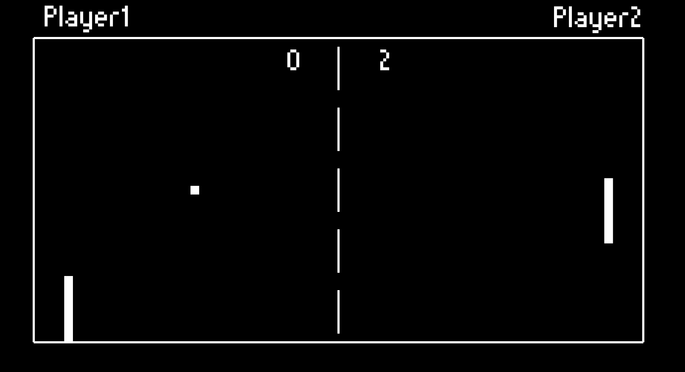

<div align="center">
  <h1 align="center">Pong Unity Clone</h1>
    <p align="center">
    My Pong clone, built with Unity in C#.
</div>

## About The Project

**Pong Unity Clone** is a 2D Pong game developed using Unity and C#. This project was created as part of a personal learning experience, following the C# Masterclass by Denis Panjuta on Udemy.
In this game, players control paddles to bounce a ball back and forth. This specific variant is intended for single players, as the computer plays as Player 2.

## Built With

- [](https://unity.com/)
- [](https://learn.microsoft.com/en-us/dotnet/csharp/)

## Getting Started

### Folder Structure

```markdown
Pong/
├── 📁 Assets/            # Game assets (sprites, sounds, etc.)
├── 📁 ProjectSettings/    # Unity project settings
├── 📁 PlayPong/           # Build folder containing the executable
├── 📄 README.md           # Project documentation
└── 📄 .gitignore          # Git ignore file
```

### Prerequisites

Ensure you have the following installed:

- [Unity Hub](https://unity.com/download)
- [Visual Studio](https://visualstudio.microsoft.com/) with Unity development workload

### Installation & Build

1. Clone the repository:

   ```sh
   git clone https://github.com/JulesBobeuf/Pong.git
   cd Pong
   ```

2. Open the project in Unity Hub.

3. Build the project for your desired platform.

### Running the Game

- **Windows**: Navigate to the `PlayPong` folder and double-click `PlayPong.exe` to start the game.

> ⚠️ **Note**: Currently, only Windows builds are available. Other platform builds may be added in the future.

## My Configuration

- **Operating System**: Windows 11
- **Unity Version**: 2020.3 (LTS)
- **IDE**: Visual Studio 2022

## Resources

- [Complete C# Masterclass by Denis Panjuta on Udemy](https://www.udemy.com/course/complete-csharp-masterclass/)
- [Unity Documentation](https://docs.unity.com/)

## License

This project is licensed under the MIT License. See the [LICENSE](LICENSE) file for details.

## Contact

Jules Bobeuf  
[LinkedIn](https://www.linkedin.com/in/bobeuf-jules/)  
bobeuf.jules@gmail.com
